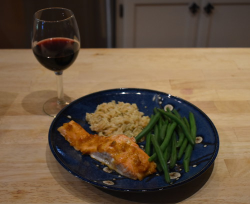

# Cooking with Concurrency

Working with coroutines is a lot like using recipes in cooking, so to explain
what concurrency is, here are a few simple recipes that I use to make a
quick dinner for the family after work:

### Salmon filets with orange-ginger dressing

<table><tr>
<td><image src="media/salmon.jpg" alt="salmon filets and dressing" /></td>
<td>
    <ul>
        <li>Preheat oven to 350 degrees F</li>
        <li>Arrange salmon filets on cooking sheet</li>
        <li>Slather each filet with 2 tbsp. of orange-ginger dressing</li>
        <li>Bake salmon in oven for 18 minutes</li>
    </ul>
</td>
</tr></table>

### Rice pilaf from a box

<table><tr>
<td><image src="media/rice.jpg" alt="box of rice pilaf" /></td>
<td>
    <ul>
        <li>Put 1 3/4 cup of water and 2 tbsp. butter in 2 qt pot</li>
        <li>Bring pot to a boil</li>
        <li>Stir in spice package and rice pilaf, cover, set to low</li>
        <li>Let simmer for 20-25 minutes</li>
        <li>Fluff, let stand for 5 minutes</li>
    </ul>
</td>
</tr></table>

### Steam in bag green beans

<table><tr>
<td><image src="media/beans.jpg" alt="steam in bag green beans" /></td>
<td>
    <ul>
        <li>Poke holes in bag, put on microwave-safe plate</li>
        <li>Microwave for 5 minutes</li>
    </ul>
</td>
</tr></table>

### Dinner!

This whole dinner takes about 30 minutes to make. Most of that time is spent
just waiting for things to finish, and when I get one recipe into a state
where I am waiting on the oven to heat up, or water to boil, I switch to
another recipe and work on that for a while. Note that I never actually
do two things at the same time. I am only ever engaged in one thing at a
time, but I can handle multiple recipes going on at the same time.

With that in mind, here are some definitions:

* **Parallelism**: Doing multiple things at the same time.
* **Concurrency**: Dealing with multiple things going on at the same time.

Cooking this simple meal for the family in just 30 minutes requires me to
use concurrency. I have to deal with multiple recipes being executed
at the same time, i.e. *concurrently*. If I was only capable of working
on a single recipe at a time, the dinner would take over an hour to prepare.

If I had a recipe that contained a lot of actual work, perhaps chopping
lots of different vegetables, then the speed at which I could finish the
dinner would be limited by my ability to only do one thing at a time. I
could in this case get a family member to help me, so that we would
both be chopping at the same time - and this would be an example of
*parallelism*.

## Dinner in Python

Now reimagine this dinner as a python module:
